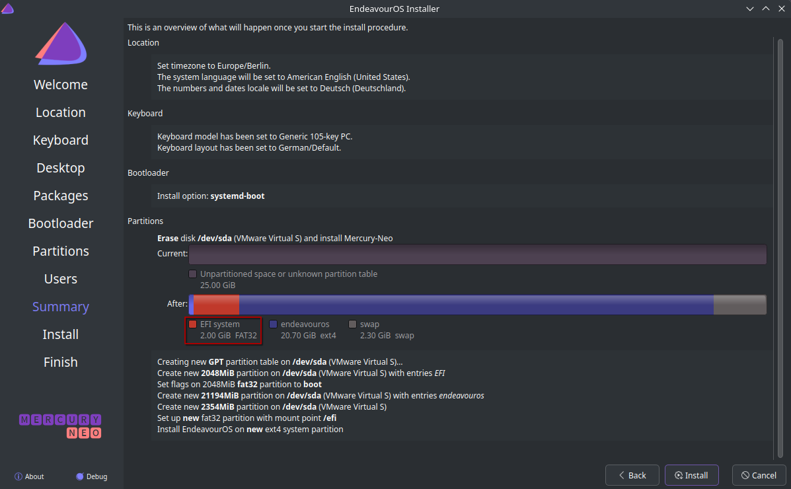

Our refresh release, Mercury Neo, is now available with updated core packages for the offline installation option and the live environment and a few bug fixes and improvements for the online installation option.

After Mercury was released on February 10th, we received a lot of valuable feedback from new and experienced users, for which we are incredibly thankful. Without that feedback we can’t move forward, so keep sending us those, no matter how trivial it might seem. We will always respond to your feedback, whether we are capable or not of addressing the issue or adding a new feature in our future releases.

There were some minor issues and upstream changes reported that were fixed through our Hotfix feature that Mercury received, but the fixes and features we are presenting with this refresh release needed a new ISO.

Before I go on into the release notes of our Mercury Neo release I’d like to highlight the following:

**The changes described over here are affecting new installs, our Calamares installer, and the Live environment on the ISO only. Running systems don’t have to “upgrade” to Mercury Neo, if you update regularly your system is fine.**

## The Mercury Neo release

Mercury Neo ships with:

- **Calamares 25.02.2.1-2**

- **Firefox 136.0.2-1**

- **Linux 6.13.7.arch1-1**

- **Mesa 1:25.0.1-2**

- **Xorg-server 21.1.16-1 (xorg)**

- **Nvidia 570.124.04-4**

Bug fixes and improvements:

- We removed installing **xwaylandvideobridge** from the installation script since it is removed upstream.

- A bug in our install script for **ranking the Arch mirrors** before installation is fixed, that resulted in failed installations in some regions in the world.

- We removed **obsolete Nvidia options** from the Nvidia boot menu.

- When choosing **Systemd in the auto-install option**, the installation process will now create a **2GB EFI partition instead of a 1GB partition**. This will give the user more space and freedom to install multiple kernels and other desirable options.

You can download the ISO over [here](/download/).
