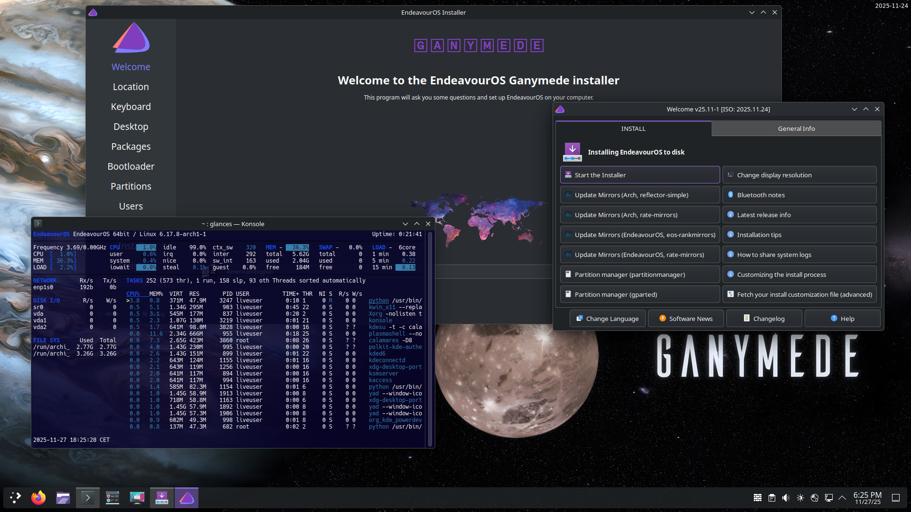

Yes, we know it has been a long time since we released an ISO refresh. So, before I start the announcement, I want to get rid of a concern or rumour: our project is still active, and we’re not going anywhere.

We still love what we do over here, but we all have chosen to let our lives and loved ones come first over the project. That certainly doesn’t mean we will let you down by letting the community hang there and our releases left to deteriorate. No, we are still active within the community, and our released ISO does receive the necessary updates regularly for the online installer to run smoothly over time. It is just the Live environment and the offline installer that get out of date.

And don’t get me wrong, we’re not underestimating the fact that those particular parts of our ISO need care, but it’s just a matter of preventing FOSS burnout. That’s all! We still love the project and our fantastic community around us.

Our head developer, Joe, is still studying hard to be a certified programmer, next to his already busy life. And the latter goes for the entire team, actually. Also, there were some unfortunate setbacks upstream at Arch Linux earlier this year, with their infrastructure being under attack, and some issues we had difficulty solving. But finally, Ganymede has arrived.

Now I have all that out of the way, let’s dive into our latest ISO release.

**The changes described over here are affecting new installs, our Calamares installer, and the Live environment on the ISO only. Running systems don’t have to “upgrade” to Ganymede; if you update regularly, your system is fine.**

## The Ganymede release

The live environment and the offline installer ship with:

- **Calamares 25.11.1.9-1**

- **Firefox 145.0.1-1**

- **Linux 6.17.8.arch1-1**

- **Mesa 1:25.2.7-1**

- **xorg-server 21.1.20-1 (xorg)**

- **Nvidia-utils 580.105.08-4**

## **General Changes and new features for the installation process.**

**Nvidia** – *NVIDIA support has been significantly improved. Previously, the ISO always included the standard `nvidia` package by default. Now, the system automatically detects the GPU during ISO boot and installs the correct driver — either **nvidia** or **nvidia-open**.*

*Support for **nvidia-open** has been added both to the ISO environment and to the installer. The detection process ensures that the appropriate modules are loaded in the Live Session and correctly installed onto the target system.*

*In short,* NVIDIA driver handling is fully automatic, supports both GPU families, and uses the correct modules for your GPU at every stage* when booting ISO using the Nvidia boot option.*

**Broadcom** **wifi** – *The **broadcom-wl** wireless driver is no longer enabled by default on the ISO because it can cause other network devices to malfunction and may lead to system issues.* 
*If a Broadcom device requiring **broadcom-wl** is detected, the live session will prompt the user with a pop-up to enable it. Once enabled in the live environment, the installer will automatically detect this and install the driver on the target system too.*

**EOS-qogir-icons** – Upstream naming updates have been implemented for the Qogir icon sets to prevent broken EOS theming on the GTK-based DE and WM installations.

## **Desktop-specific installation improvements**

**Plasma**

- The Maliit virtual keyboard has been replaced with the Qt6 virtual keyboard for SDDM.

- Libappindicator-gtk3 has been replaced by Libappindicator.

**GNOME**

- Gnome-screenshot has been removed from the default install packages.

**LXDE**

- GTK3 postfixes have been removed from the package names.

- Obconf has been replaced by lxappearance-obconf-gtk3.

- Pacmanfm-gtk3 has been renamed by pacmanfm.

## **i3-WM**

- Xbacklight has been replaced by brightnessctl.

## **Open issue**

This one in particular was and still is the headscratcher we eventually couldn’t solve for now.

Due to upstream Systemd-boot changes, Windows 11 isn’t booting when installed on a separate drive in some cases. It does work with GRUB, though. ***When installing EndeavourOS next to Windows on the same drive, there are no issues. This only affects dual-boot options on separate drives using Systemd-boot.***

We recommend following the instructions below for such cases, with a major shout-out to @BS86

[https://forum.endeavouros.com/t/tutorial-add-a-systemd-boot-loader-menu-entry-for-a-windows-installation-using-a-separate-esp-partition/37431](https://forum.endeavouros.com/t/tutorial-add-a-systemd-boot-loader-menu-entry-for-a-windows-installation-using-a-separate-esp-partition/37431)

We want to thank the ISO test group for their infinite and meticulous testing of our release candidates over the past few months and our entire community for reporting bugs and thinking with us in solving them. And last but certainly not least @UncleSpellbinder for his amazing contribution in creating the Ganymede wallpaper.

The ISO can be grabbed from our website’s [homepage](/).
