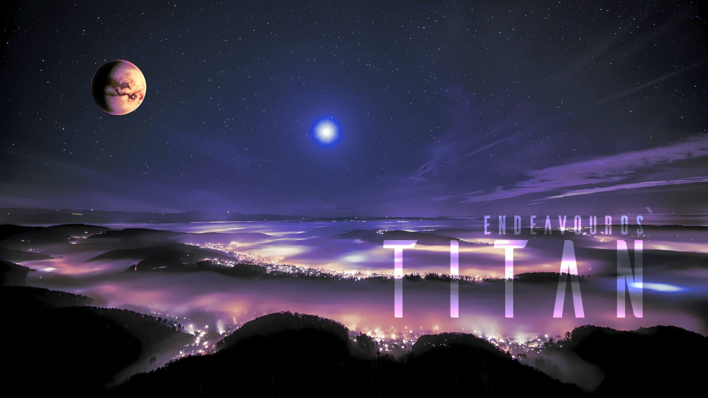

Six weeks after our Titan release, we refreshed our ISO, Titan Neo, with some fixes and minor improvements.

Our team is hard at work on the development of our next major release, Triton, which will come with new changes with the future in mind. I can reveal that Triton will be shipping new DE and WM options, but we are also going to say goodbye to some of our current installation options.

The image used above is not our new wallpaper for Titan Neo, but an earlier draft for the Titan release, created by our community member Unclespellbinder. If you want to download the image, [click on this link to retrieve it](/news/whats-new-in-endeavouros-titan-release/).

## The Titan Neo release

Of course, it is unnecessary to mention, but I will remind you, though.

**The changes described over here are affecting new installs, our Calamares installer, the offline installer and the Live environment on the ISO only. Running systems don’t have to “upgrade” to Titan Neo; if you update regularly, your system is fine.**

Titan Neo’s live environment and offline installer are shipping with:

- Calamares 26.03.2.3-1

- Firefox 150.0-1

- Linux 6.19.14.arch1-1

- Mesa 1:26.0.5-1

- Xorg-server 21.1.22-1 (xorg)

- Nvidia-utils 595.58.03-2

## Fixes

- Resolved a problem where eos-settings packages utilising skel were being installed post user creation, guaranteeing that your personal configurations are applied correctly.

- **XFCE Desktop:** Removed `xfce4-datetime-plugin` from the package list, as it is no longer available in the repositories.

- **Printing Support:** The `splix` package has been removed from the “Support for printing (Cups)” netinstall option to keep the installation lean and functional.

## Small improvements

- **Plasma KDE & Nvidia:** To provide a more stable experience for **Nvidia** users, we have switched from SDDM to `plasma-login-manager`. This significantly improves compatibility when running proprietary Nvidia drivers.

- Torrent downloads have been improved to provide a faster download speed.

You can download Titan Neo from our [homepage](/download/).
