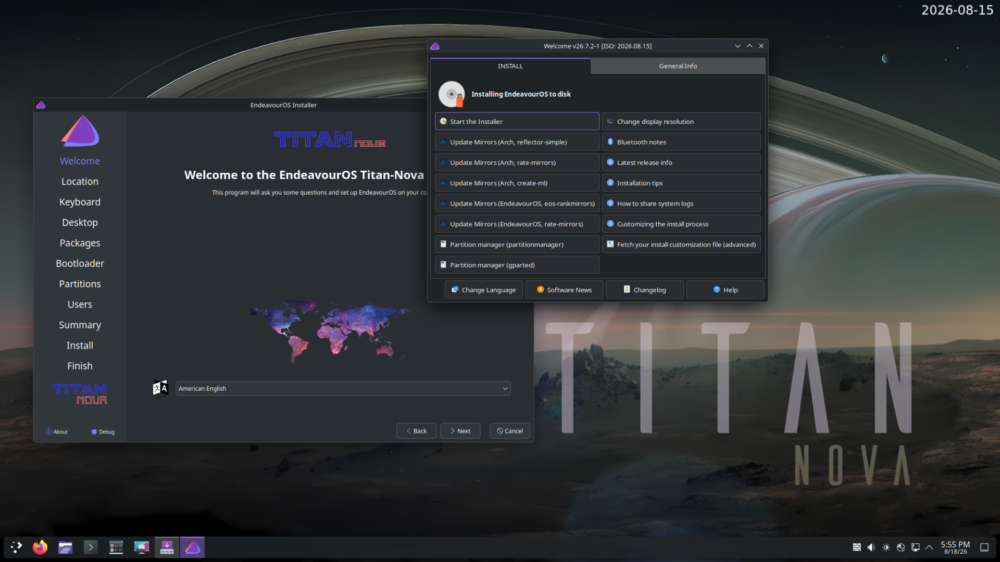

It’s been a while since we released Titan Neo back in March. And to be honest, we thought we would have our next major release, Triton, out by now. But as with most things in life, the road to the next step isn’t easy. In fact, Triton’s journey is obstructed by meteors and asteroids, so to speak. So, we need some more time to finish the work on Triton. The next release will be running Wayland in the Live environment, due to upcoming changes with the Plasma desktop environment. And as you can imagine, this is a major challenge for our development team. That is why we decided to give Titan an update boost to act as a bridge to the Triton release.

So, don’t expect big changes. This release includes the necessary hardware support upgrades and a few bug fixes.

## The Titan Nova release

Of course, it is unnecessary to mention, but I will remind you, though.

**The changes described here affect new installs, our Calamares installer, the offline installer, and the Live environment on the ISO only. Running systems don’t have to “upgrade” to Titan Nova; if you update regularly, your system is fine.**

Titan Nova’s live environment and offline installer are shipping with:

- Calamares 26.03.2.3-1

- Firefox 153.0.4-1

- Linux 7.1.8.arch1-3

- Mesa 1:26.1.7-1

- Xorg-server 21.1.24-1 (xorg)

- Nvidia-utils 610.57.04-1

- Nvidia-open 610.54.01-6

## Bug fixes & temporary patch solutions

- **Keyboard Setup Fix:** Fixed an issue where recent keyboard configuration updates caused setup errors. A temporary patch is in place to ensure everything configures smoothly, with a permanent fix planned in the upcoming Triton release.

- Improved the experience on the ISO when using the Nouveau drivers for NVIDIA GPUs.

- **Budgie Desktop Removed:** The option to install the Budgie desktop environment has been temporarily removed. The current upstream software version is in a transition phase to newer display technology (Wayland) and isn’t providing a default experience we are comfortable with. We expect Budgie to return in future releases.

Last but not least, a big shoutout to our community testing team for your patience and to Unclespellbinder for providing us with that great Titan Nova wallpaper!

[You can download and/or seed the Torrent or Magnet files over here.](/download/)
