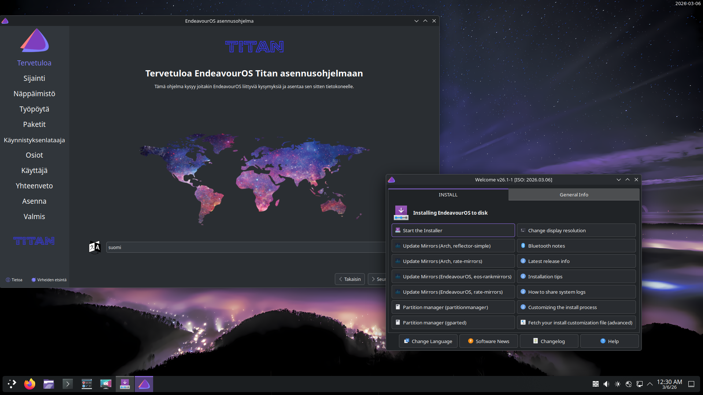

Earlier this month, the Linux kernel 6.19 was released, and that was a good excuse to refresh our ISO. And as you can read from the title, the changes for this one were big enough to turn it into a major release with a name that really covers this ISO. Named after the second-largest moon in our solar system, Titan. So, we borrowed Saturn’s largest moon to orbit around our purple Linux space for now. This theme is also reflected in the new wallpaper that was created by our very creative and trusty community member, Unclespellbinder.

But before I go into the Titan release, I just want to address the recent development concerning age verification for all operating systems in California for 2027.

## Age verification law

Like many of you, we were surprised by the news last week, and questions quickly followed about our position on this matter. We just have to wait to see how this will develop for FOSS and Linux in general. It isn’t easy for us to make a clear statement on it at this moment, because this decision involves not only the distros but also DE/WM environments, software packages and mirror networks. ***Like Arch, we don’t have any infrastructure to track how many users download or install our system, let alone who is running Endeavour on their machines. Besides the fact that it goes against FOSS fundamentals, we simply don’t have the manpower or resources to take on this near-impossible task. ***

Also, in creating this law, not a single person or entity from the FOSS world was represented or heard, and there is still a window of opportunity open to address the concerns for open source software and Linux/Freebsd systems before the law takes effect. ***After the news dropped, the OSI, FSF, and Linux Foundation must have realised their mistake in not reacting in time and hopefully will come into action for the many distributions and other FOSS projects, like us, that don’t have Californian or US legal representation. So, all eyes are on them, because Colorado and the rest of the world are next…*** We are not blaming any of the organisations mentioned by the way. We are just pointing out that the law isn’t set in stone, yet.

Okay, now that’s out of the way, let’s get into the joyous news of the Titan release.

## The Titan release

*Wallpaper created by Unclespellbinder*

Of course, it is unnecessary to mention, but I will remind you, though.

**The changes described over here are affecting new installs, our Calamares installer, and the Live environment on the ISO only. Running systems don’t have to “upgrade” to Titan; if you update regularly, your system is fine.**

Titan’s live environment and offline installer are shipping with:

- Calamares 26.03.1.3-1

- Firefox 148.0-1

- Linux 6.19.6.arch1-1

- Mesa 1:26.0.1-1

- Xorg-server 21.1.21-1 (xorg)

- Nvidia-utils 590.48.01-4

For this release, we cleaned up and streamlined the installation process and added some new big features alongside.

- **Improved mirror ranking support**, including providing an optimised mirror list when the installer is offline

- **Added hardware detection for all GPUs and VMs**

- **We are now installing additional drivers for all GPUs**, including Vulkan drivers and the needed packages for hardware-accelerated video decoding when applicable

- **GPU drivers are now being loaded early by default**

- **This release also introduces a new tool**, `eos-hwtool`. This is the tool being used by the installer, and it is also available now to all EOS users to install and remove GPU drivers whenever needed.

A very noticeable change also, is the slight increase in size of the ISO in comparison to Titan’s predecessors. It increased from around 3 GB to 3.4 GB. This increase has all to do with the new features we have shipped to create a smoother installation process and has nothing to do with us adding a more “bloated” OS or DE experience. We have stayed true to our very principles in providing an almost clean Linux experience, ready to customise to your needs.

I hope you have fun with Titan, as we’ve had fun creating it for you, and we would like to thank all of our wonderful community members who were involved in giving feedback on our forum/Telegram group, creating and testing this release. We think the world of you!

Titan is available for download on [our homepage](/).
